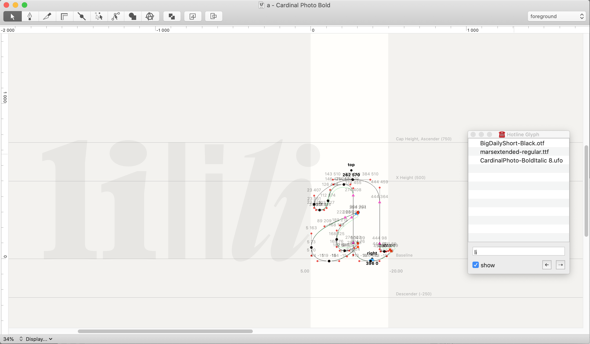
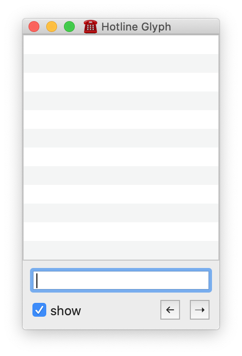

# ☎️ Hotline Glyph

A small extension to preview other fonts in the glyph view.  
It serves somehow as a replacement for `Preview Multiple Fonts`.

## Install
Double click on `HotlineGlyph.roboFontExt`.

## How to use
* Drag & drop your font files (ufo, otf or ttf) in the list.
* Write the desired text in the text edit panel.
* It will display your input in the glyph window.

The `←` and `→` buttons will switch the view from left sidebearing to right sidebearing.

## Roadmap
* Fix left and right buttons
* Two columns interface to display fonts to either side of the current glyph.
* Preference window.

## Credits

HotlineGlyph rely heavily on [RamsaySt](https://github.com/typemytype/ramsayStreetRoboFontExtension) from Frederik Berlaen.
